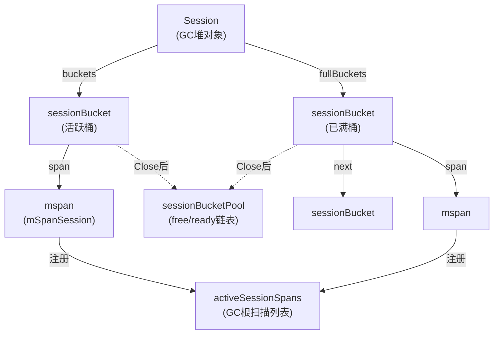
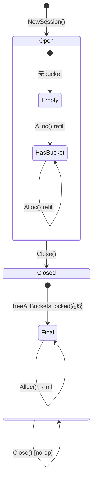
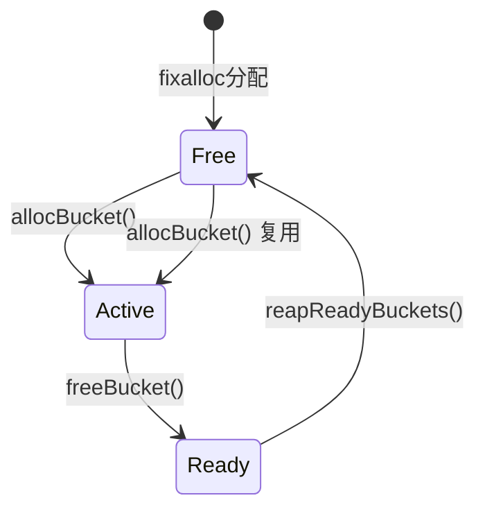
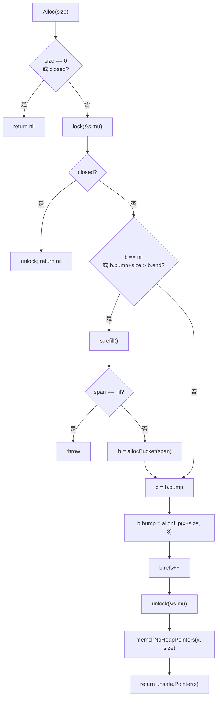
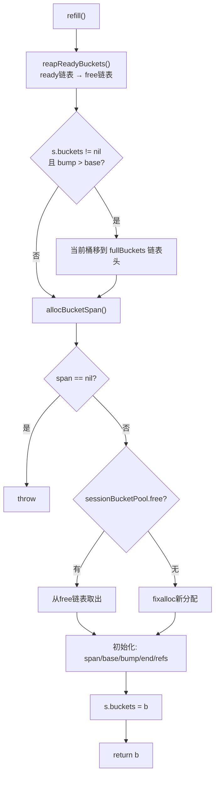
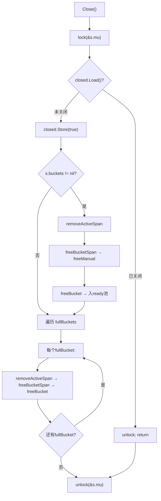

# Session Memory 设计文档

## 1. 设计目的

### 1.1 为什么需要 Session Memory

Go runtime 的 GC 堆分配路径 `mallocgc` 是为通用场景设计的：每个对象独立分配、独立扫描、独立回收。这个模型的代价是：

- **分配开销**：每次 `mallocgc` 需要查 size class 表、从 per-P mcache 获取 span、处理 free list，路径长约 100+ 行代码
- **扫描开销**：GC mark 阶段扫描每个对象的指针，对象数量越多扫描时间越长
- **释放开销**：sweep 阶段逐对象归还，释放成本与对象数量线性相关

在请求/响应场景（HTTP handler、RPC server、流处理）中，一个请求周期会产生 50-200 个临时对象，它们的生命周期完全一致——请求开始时分配，请求结束时集体死亡。Session Memory 的目标是：**让这组生命周期一致的对象共享同一块内存区域，分配时 bump-alloc，释放时整块归还**。

### 1.2 设计状态

| 属性 | 值 |
|------|-----|
| 目标分支 | `lanyy/996` |
| 目标项目 | Go runtime (`std`) |
| 设计时间 | 2026-07 |
| 设计阶段 | Phase 1 — 显式 Close 释放 |
| 相关文档 | `session_memory_test_design.md` |

### 1.3 目标定性

这是一个 **新模块** 设计——在 runtime 中新增 Session Memory 子系统。Phase 1 采用显式 Close 模型（调用者负责生命周期管理），后续 Phase 会考虑 GC 自动回收。

---

## 2. 概念空间

在进入设计逻辑之前，先建立核心概念。以下概念是本文的"术语表"，后续所有章节都使用这些名称。

### 2.1 新概念定义

| 概念 | 构成 | 封装了什么 |
|------|------|-----------|
| **Session**（会话） | GC 堆对象 + mutex + closed 标记 | 一组生命周期一致的对象集合的句柄。对标 `sync.Pool` 的 batch 释放粒度，但不依赖 GC 周期 |
| **sessionBucket**（会话桶） | mspan + bump 指针 + refs 计数 | 一块 64KB 的连续内存，bump 分配器的工作区。封装了"从大块内存中切小对象"的复杂度 |
| **activeSessionSpan**（活跃会话 span） | mSpanSession 状态的 mspan | GC 保守扫描根。封装了"GC 需要知道哪些 span 属于活跃会话"的追踪关系 |
| **bump allocation**（递增分配） | base + bump + end + alignUp | 通过移动指针分配内存，无需 free list。封装了"从大块中切分"的简单算术 |
| **bucket pool**（桶元数据池） | free 链表 + ready 链表 | sessionBucket 结构体的复用池。封装了"分配/归还 metadata"的 fixalloc 增强 |

### 2.2 概念关系图



### 2.3 Session 状态机（closed vs open）



Session 只有两个顶层状态，但这不是"开关"——因为 `Open` 内的子状态（Empty/HasBucket）决定了 `Alloc` 的行为路径不同（直接 bump vs refill），且 `Close` 后 `Alloc` 返回 nil 是完全不同的处理范式（立即拒绝 vs 走分配路径）。

### 2.4 Bucket 元数据生命周期



这是两段池设计，与三段池（free/ready/scav）的区别在于：span 的 OS 归还由 mheap 的 manual span 管理路径处理，bucket pool 只管理元数据（`sessionBucket` struct）的复用。

---

## 3. 设计逻辑

### 3.1 核心挑战与取舍

本设计面临三个核心挑战：

**挑战 1：分配速度 vs 内存利用率**

- **选择**：固定 64KB bucket，bump 分配，8 字节对齐
- **为什么不用可变 bucket size**：bump 分配器的价值在于"指针移动即分配"的极致简单性。可变 size 需要引入类似 size class 的查找机制，这恰好是我们要避免的。固定 64KB 在大多数请求场景下足够（单次请求的临时对象总和通常 < 64KB）
- **为什么不用 Arena 的大 Chunk 方案**：arena 需要手动 Free，且 chunk 内对象必须全部不可达才安全释放。Session 的 bucket 粒度更细，且 Close 语义更明确

**挑战 2：GC 安全 vs 实现复杂度**

- **选择**：`mSpanSession` 状态 + 保守根扫描 + `findObject` 跳过
- **为什么不用 write barrier 跟踪 session→heap 指针**：write barrier 是 per-pointer 开销，bump 分配的对象没有类型信息，无法生成 bitmap。保守扫描将整个 span 内容当作指针扫描，不需要 per-object 类型信息，代价是少量误标记（false positive），不影响正确性
- **为什么 `findObject` 要跳过 `mSpanSession`**：heap→session 指针是编程错误（session 内对象不应逃逸到堆），跳过意味着 GC 不追踪反向引用，这既是正确性要求（已经 Close 的 session 的 span 会被释放），也是封闭世界模型的边界

**挑战 3：并发安全 vs 锁开销**

- **选择**：per-Session mutex + atomic.Bool 快速路径
- **为什么不用 per-P 无锁方案**（像 sync.Pool）：sync.Pool 的 get/put 是单对象操作，Session 的 Alloc 可能触发 refill（需要跨 P 操作：allocManual、bucket pool），无法完全 per-P 本地化。per-Session mutex 的粒度足够细（每个请求一个 Session），锁竞争在并发分配场景中由同一个 Session 的多个 goroutine 共享时才会出现
- **close 双检锁**：`closed` 用 `atomic.Bool` 提供快速路径（无锁 Load），只在不确定时获取锁做二次确认。这是经典的双检锁模式在 Go 中的安全应用

### 3.2 Alloc 流程



### 3.3 refill 流程



### 3.4 Close 流程



### 3.5 模块依赖关系

Session Memory 与 runtime 已有模块的关系：

| 依赖模块 | 关系 | 说明 |
|---------|------|------|
| `mheap` (allocManual/freeManual) | **薄封装暴露** | 直接调用 allocManual/freeManual 管理 bucket span。不需要包装，因为 Session 就是 manual span 的一种使用方 |
| `GC (markroot)` | **完全封装** | Session span 通过 `fixedRootSessionSpans` 注册为 GC 根。markroot 只需调用 `markrootSessionSpans`，无需了解 bucket 内部结构 |
| `findObject` | **条件跳过** | 新增 `mSpanSession` 判断。这不是封装，是必要的状态区分 |
| `fixalloc` | **完全封装** | sessionBucket 的分配/释放封装在 `allocBucket`/`freeBucket` 内部，外部不感知 fixalloc |
| `memclrNoHeapPointers` | **直接使用** | bump 分配后清零，属于标准 runtime 原语 |

---

## 4. 核心数据结构

### 4.1 Session

```go
// Session 是一组生命周期一致对象的 bump-alloc 句柄。
// 通过 NewSession() 创建，Close() 必须被调用以立即释放所有关联内存。
type Session struct {
    buckets     *sessionBucket // 活跃桶（当前 bump 分配目标）
    fullBuckets *sessionBucket // 已满桶链表（单向链表，头插法）
    mu          mutex          // 保护 buckets/fullBuckets 的并发访问
    closed      atomic.Bool    // use-after-close 防护；true 表示已关闭
}
```

**数据关系**：
- `buckets` 是唯一有剩余空间的桶，所有 `Alloc` 先从此桶尝试
- `fullBuckets` 链表按 Close 释放顺序组织（头插，顺序无关紧要，因为 Close 时遍历全部释放）
- `mu` 同时保护 `buckets`、`fullBuckets` 和 `Close` 中的状态切换
- `closed` 独立于 `mu` 提供快速路径检查（加锁前）和锁内可靠检查（加锁后）

### 4.2 sessionBucket

```go
// sessionBucket 是一块 64KB 的 bump-alloc 工作区，由一个 mspan 支持。
// 元数据通过 fixalloc 在 NotInHeap 上分配，GC 不扫描。
type sessionBucket struct {
    _    sys.NotInHeap
    next *sessionBucket // fullBuckets 链表指针
    span *mspan         // 底层 mspan（mSpanSession 状态）
    base uintptr        // 可用内存起始地址 (= span.base())
    bump uintptr        // 当前分配指针（bump 分配的核心）
    end  uintptr        // 可用内存结束地址 (= base + span.npages*pageSize)
    refs atomic.Int32   // bucket 内已分配对象计数（调试/统计用，Phase 1 不用于释放决策）
}
```

**关键不变量**：`base <= bump <= end`，且 `bump` 始终 8 字节对齐。

### 4.3 全局跟踪结构

```go
// activeSessionSpans 是活跃 session bucket span 的扁平列表。
// GC mark 阶段通过 markrootSessionSpans 保守扫描每个 span，
// 确保 session→heap 指针被正确追踪。
var activeSessionSpans struct {
    mu    mutex
    spans []*mspan // swap-remove 实现 O(1) 删除
}

// sessionBucketPool 是 bucket 元数据的复用池。
// 两段设计：free（立即可用）和 ready（等待 span 清零后可用）。
var sessionBucketPool struct {
    mu    mutex
    free  *sessionBucket // 清零完成，可立即分配
    ready *sessionBucket // 已释放但 span 未清零
}

// sessionBucketAlloc 为 bucket 元数据提供 fixalloc 分配。
var sessionBucketAlloc struct {
    mu  mutex
    fix fixalloc // 分配 size = unsafe.Sizeof(sessionBucket{})
}
```

### 4.4 状态机矩阵

#### Session 状态×刺激矩阵

| 状态 \ 刺激 | `Alloc(size)` | `Close()` |
|------------|---------------|-----------|
| **Open** (closed=false) | 执行 bump 分配（可能触犯 refill），返回指针 | 设置 closed=true，释放所有 bucket span，bucket metadata 入 ready 池 |
| **Closed** (closed=true) | 返回 nil | no-op（锁内检查 closed，直接返回） |

#### Bucket 元数据状态×刺激矩阵

| 状态 \ 刺激 | `allocBucket()` | `freeBucket()` | `reapReadyBuckets()` |
|------------|-----------------|----------------|----------------------|
| **Free** | 取出，设为 Active | — （不会发生） | — （已在 Free） |
| **Active** | — （已在用） | 释放 span 引用，移到 Ready | — （不会发生） |
| **Ready** | — （不会发生） | — （不会发生） | 标记 span.needzero，移到 Free |

#### activeSessionSpan 状态×刺激矩阵

| 状态 \ 刺激 | `allocBucketSpan` | `Close` / `freeAllBucketsLocked` | GC markroot |
|------------|-------------------|--------------------------------|-------------|
| **不在列表中** | allocManual 成功后 `addActiveSpan`，加入列表 | — | 不扫描 |
| **在列表中** | — | `removeActiveSpan`，O(1) swap-remove | 调用 `markrootSessionSpans` 保守扫描 |

---

## 5. 接口定义

### 5.1 公开接口

```go
// NewSession 创建一个新的内存分配会话。
// 返回的 Session 必须通过 Close() 释放，否则内存泄漏。
//
//go:nosplit
func NewSession() *Session
```

```go
// Alloc 从会话中分配 size 字节的零初始化内存。
// 返回的指针在 Session 关闭前有效。
// 如果 size == 0 或会话已关闭，返回 nil。
func (s *Session) Alloc(size uintptr) unsafe.Pointer
```

```go
// Close 立即释放通过本 Session 分配的所有内存。
// Close 后，Alloc 的任何调用都返回 nil。
// Close 可安全地多次调用（后续调用为 no-op）。
func (s *Session) Close()
```

**接口关系总结**：用户通过 `NewSession` 创建会话 → 通过 `Alloc` 从会话分配内存 → 通过 `Close` 立即归还所有分配的内存。这是 RAII 模式在 Go 中的显式实现——Go 没有析构函数，所以 `Close` 是必要的。

### 5.2 内部接口（Runtime 集成）

```go
// allocBucketSpan 从 mheap 分配一个新的 mspan（mSpanSession 状态）。
// 成功后将 span 注册到 activeSessionSpans 用于 GC 根扫描。
// 调用者必须持有 s.mu。
func (s *Session) allocBucketSpan() *mspan

// freeBucketSpan 将 bucket 的 mspan 归还给 mheap。
// 通过 freeManual 立即归还，不等待 GC sweep。
func freeBucketSpan(span *mspan)

// refill 获取新活跃桶。将当前桶（如有）移到 fullBuckets。
// 调用者必须持有 s.mu。
func (s *Session) refill() *sessionBucket

// freeAllBucketsLocked 释放所有 bucket 的 span 和元数据。
// 调用者必须持有 s.mu。
func (s *Session) freeAllBucketsLocked()
```

```go
// markrootSessionSpans 是 GC 固定根，保守扫描所有活跃 session span，
// 追踪 session→heap 指针。
// 在并发 mark 阶段被 markroot 调用。
func markrootSessionSpans(gcw *gcWork)

// addActiveSpan 将 session bucket span 注册为 GC 根扫描目标。
func addActiveSpan(s *mspan)

// removeActiveSpan 从 GC 根扫描列表中移除 span。
// 使用 swap-remove 实现 O(1) 删除。
func removeActiveSpan(s *mspan)
```

```go
// allocBucket 从池中获取或新分配 sessionBucket 元数据。
func allocBucket(s *mspan) *sessionBucket

// freeBucket 归还 bucket 元数据到 ready 池。
func freeBucket(b *sessionBucket)

// reapReadyBuckets 将 ready 池中的 bucket 移到 free 池。
// 标记 span.needzero 以便后续分配时清零。
func reapReadyBuckets()
```

### 5.3 mheap.go 新增定义

```go
// mSpanSession 是 span 状态之一。Session bucket span 的 GC 行为：
// - 保守根扫描（不是类型导向扫描）
// - findObject 跳过（不追踪 heap→session 指针）
// - 不参与 sweep（通过 freeManual 直接归还）
mSpanSession mSpanState = 3

// spanAllocSession 是 span 分配类型。用于 allocManual/freeManual，
// initSpan 自动设置状态为 mSpanSession。
spanAllocSession spanAllocType = 3

// _KindSpecialSession 是 special 类型（Phase 1 预留）。
// specialSession 关联 heap 对象与其所属 session bucket。
_KindSpecialSession = 11
```

---

## 6. 一致性校验

### 6.1 概念一致性

| 检查项 | 状态 | 说明 |
|--------|------|------|
| Session 术语一致 | ✅ | 全文使用 "Session"（大写），不混用 "session"/"sess" |
| bucket 术语一致 | ✅ | "sessionBucket" 或 "bucket"，不混用 "chunk"/"block"/"arena" |
| "span" 始终指向 `*mspan` | ✅ | 不模糊地使用 "span" 表示其他含义 |
| closed 语义一致 | ✅ | 全文指 `atomic.Bool` 上的 use-after-close 防护，不泛化为 "status"/"state" |
| 保守扫描 (conservative scan) | ✅ | 全文使用同一术语，不混用 "pointer guessing"/"speculative scan" |

### 6.2 状态完备性

| 状态机 | 每个状态×每个刺激是否都有定义 | 非法情况的处理 |
|--------|-------------------------------|---------------|
| Session Open/Closed | ✅ | Alloc 在 Closed 状态：返回 nil。Close 在 Closed 状态：no-op |
| Bucket Free/Active/Ready | ✅ | 非法转换（如 Active→Free 直接跳）在代码路径中不可能发生，因为 freeBucket 总是经过 Ready |
| activeSessionSpan 在列表/不在列表 | ✅ | 重复 add 或 remove 不存在——span 生命周期由 Session 唯一拥有 |

### 6.3 接口完备性

| 设计逻辑中提到的操作 | 对应接口 | 状态 |
|---------------------|---------|------|
| 创建会话 | `NewSession()` | ✅ |
| 分配内存 | `(s *Session) Alloc(size)` | ✅ |
| 释放所有内存 | `(s *Session) Close()` | ✅ |
| 注册 GC 根 | `addActiveSpan(s)` | ✅ |
| 注销 GC 根 | `removeActiveSpan(s)` | ✅ |
| GC 根扫描 | `markrootSessionSpans(gcw)` | ✅ |
| Bucket 元数据分配 | `allocBucket(s)` | ✅ |
| Bucket 元数据归还 | `freeBucket(b)` | ✅ |
| 元数据回收 | `reapReadyBuckets()` | ✅ |
| Span 分配 | `(s *Session) allocBucketSpan()` | ✅ |
| Span 归还 | `freeBucketSpan(span)` | ✅ |

### 6.4 层次一致性

| 检查项 | 状态 | 说明 |
|--------|------|------|
| Session 层是否承担了 mheap 的职责 | ✅ 否 | Session 通过 `allocManual`/`freeManual` 调用 mheap，不直接操作 heap 锁或 span 链表 |
| Session 层是否承担了 GC 的职责 | ✅ 否 | Session 不触发 GC，不操作 mark 位，仅注册/注销 GC 扫描根 |
| markrootSessionSpans 是否承担了 scanobject 的职责 | ✅ 否 | 保守扫描使用 `findObject`+`greyobject` 标准 GC 原语，不复制 scanobject 逻辑 |

### 6.5 安全性与可靠性

| 检查项 | 状态 | 说明 |
|--------|------|------|
| use-after-close | ✅ 已防护 | `closed atomic.Bool` + 双检锁模式，close 后 alloc 返回 nil |
| 内存泄漏（用户忘记 Close） | ⚠️ 已知风险 | Phase 1 依赖调用者关闭，设计目标中已明确。Phase 2 将增加 GC 自动回收 |
| 并发安全 | ✅ | per-Session mutex + atomic 快速路径；race detector 通过 |
| GC 正确性（session→heap 指针） | ✅ | 保守根扫描确保被 session 引用的 heap 对象不会被 GC 错误回收 |
| GC 正确性（heap→session 指针） | ✅ | findObject 跳过 mSpanSession，不产生 badPointer 错误 |

---

## 7. 变更历史

| 日期 | 变更内容 | 原因 |
|------|---------|------|
| 2026-07-02 | 初始版本：显式 Close 释放模型 | Phase 1 实现 |
| 2026-07-02 | 根据 module-design/state-machine-design skill 重写文档 | 优化概念空间、状态机建模、一致性校验 |
